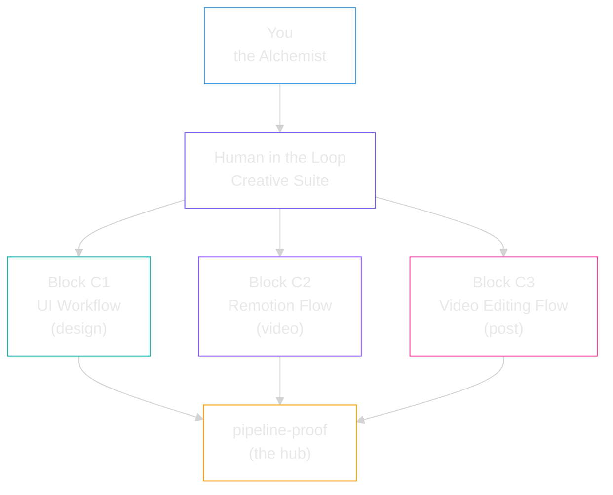
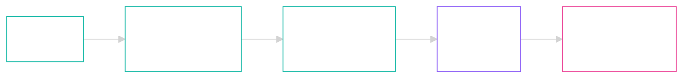

<picture>
  <source media="(prefers-color-scheme: dark)" srcset="assets/logo-dark.svg">
  <source media="(prefers-color-scheme: light)" srcset="assets/logo-light.svg">
  
</picture>

 

**Audio and visuals without the slop, for smart entrepreneurs.**
**You're the alchemist. Claude's the engineer.**

> [!NOTE]
> **TL;DR.** Three Claude Code tools, one philosophy. You stay in the seat for every creative call. Claude does the engineering labour you don't want to do. Block C1 = design, Block C2 = video, Block C3 = post.

---

## Start here: the pipeline-proof hub

If you've never seen Claude Code before, watch the explainers first. The repos in this folder are the deeper-dive material once you've got the lay of the land.

**Front door for everything in this folder:**

**[pipeline-proof.netlify.app](https://pipeline-proof.netlify.app/)**

---

## Why this exists

The slop problem: anyone can spin up generic AI content. What's rare is taste. What's missing in 90% of AI workflows is the human in the loop, making the creative calls that actually matter.

These three tools split the work where it should split. Humans on judgement, taste, and direction. Claude on transcription, scoring, rendering, and the boring craft. You stay in the seat. Claude does the labour.

The result: audio and visuals that don't look or sound like AI made them.

---

## The Suite at a glance

---

## The three tools

| Block | Folder | What goes in | What comes out | Canonical repo |
|---|---|---|---|---|
| **C1** | `claude-ui-workflow-main/` | A brand URL | A locked Stitch design brief, ready to paste | [sellersessions/claude-ui-workflow](https://github.com/sellersessions/claude-ui-workflow) |
| **C2** | `claude-remotion-flow-main/` | A treatment markdown | A rendered MP4, beat-synced, voice-cloned | [sellersessions/claude-remotion-flow](https://github.com/sellersessions/claude-remotion-flow) |
| **C3** | `claude-video-editing-flow-main/` | A raw `.mp4` | A short-form cut, picked from a tickable terminal table | [sellersessions/claude-video-editing-flow](https://github.com/sellersessions/claude-video-editing-flow) |

Each folder has a `README.md` (full overview) and a `STAGE-CMD.md` (the exact commands run on stage).

---

## Block C1: Claude UI Workflow

Brand brief in, production UI out. 10 stages, 165+ design rules across 15 databases. Working examples in `brands/` (retechuk, databrill).

→ [Open the full README](./claude-ui-workflow-main/README.md)

---

## Block C2: Claude Remotion Flow

Treatment-driven video factory. Write a treatment doc, Claude generates Remotion code, scrub in Studio, render MP4. No timeline. No keyframes. No After Effects.

→ [Open the full README](./claude-remotion-flow-main/README.md)

---

## Block C3: Claude Video Editing Flow

Drop any video. Claude transcribes, scores and ranks every quotable segment. You tick the candidates. Claude renders. Selection is human, correction is Claude.

→ [Open the full README](./claude-video-editing-flow-main/README.md)

---

## What's NOT in here (and where to get it)

The repos gitignore heavyweight media (mp4, wav, render output) so the download stays fast. To get those:

| You want | Where to get it |
|---|---|
| Walkthrough videos | [pipeline-proof.netlify.app/explainers.html](https://pipeline-proof.netlify.app/explainers.html) |
| Demo media bundles | GitHub Releases on each canonical repo (e.g. video-editing-flow `v0.1-demo`) |
| Remotion source clips | Recoverable via the project's `MANIFEST.json` + scraper scripts |

---

## How to follow along

1. Open the **[pipeline-proof hub](https://pipeline-proof.netlify.app/)** in a browser. Watch the explainers.
2. Pick the tool you want to try first (UI Workflow, Remotion Flow, or Video Editing Flow).
3. Open that folder's `README.md` for the overview, then `STAGE-CMD.md` for the exact demo flow.

## Questions

If something's broken or missing, ping the SSL 2026 attendee channel.
