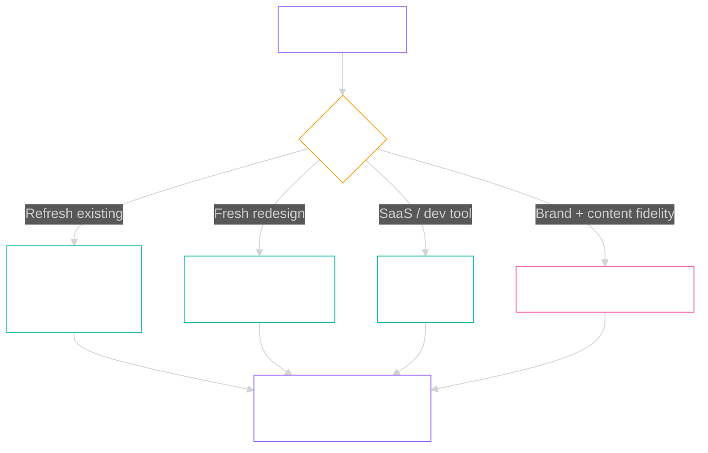

# Design Pipeline — Architecture Deep-Dive

> Companion to [`README.md`](README.md) — the technical layer for designers and developers extending the system.
> The 10-stage canonical lives in [`PRE-CHECK-CHECKLISTS.md`](PRE-CHECK-CHECKLISTS.md). Stitch model rules in [`STITCH-MODEL-RULES.md`](STITCH-MODEL-RULES.md). Operating playbook in [`RUNBOOK.md`](RUNBOOK.md).

---

## What this document is

The 10-stage pipeline turns user intent + brand inputs into premium design output, with an invisible guardrail layer (15 CSV databases, 165+ rules) enforcing UI/UX rules at every gate. Claude Code orchestrates between local tools (CSV rule database, brand profiles), MCP servers (Stitch, NB2, video-transcriber, 21st.dev), Playwright (auth-persisted Chromium for Stitch), and the user.

There is **no `npm run pipeline`** — that was never the design. The pipeline is a workflow surface; each stage is independently runnable.

---

## Top-level flow

```mermaid
%%{init: {'theme': 'dark', 'themeVariables': {'clusterBkg': 'transparent', 'nodeTextColor': '#e8e8e8', 'primaryTextColor': '#e8e8e8'}}}%%
flowchart LR
    S1["Stage 1<br/>INTAKE<br/><i>Class B</i>"] --> S2["Stage 2<br/>URL ingestion<br/><i>Class A</i>"]
    S2 --> S3["Stage 3<br/>Screenshot assist<br/><i>Class A</i>"]
    S3 --> S4["Stage 4<br/>Tokens validate<br/><i>Class A</i>"]
    S4 --> S5["Stage 5<br/>Lock primitive<br/><i>Class A</i>"]
    S5 --> S6["Stage 6<br/>Brief assembly<br/><i>Class B</i>"]
    S6 --> S7["Stage 7<br/>Stitch generation<br/><i>Class B</i>"]
    S7 --> S8["Stage 8<br/>REFINE pass<br/><i>Class B</i>"]
    S8 --> S9["Stage 9<br/>Cycle retro<br/><i>Class B</i>"]
    S9 --> S10["Stage 10<br/>Reset gate<br/><i>Class B</i>"]
    S10 -.->|next cycle| S1

    style S1 fill:none,stroke:#14B8A6,stroke-width:1px,color:#fff
    style S2 fill:none,stroke:#14B8A6,stroke-width:1px,color:#fff
    style S3 fill:none,stroke:#14B8A6,stroke-width:1px,color:#fff
    style S4 fill:none,stroke:#14B8A6,stroke-width:1px,color:#fff
    style S5 fill:none,stroke:#14B8A6,stroke-width:1px,color:#fff
    style S6 fill:none,stroke:#8B5CF6,stroke-width:1px,color:#fff
    style S7 fill:none,stroke:#8B5CF6,stroke-width:1px,color:#fff
    style S8 fill:none,stroke:#EC4899,stroke-width:1px,color:#fff
    style S9 fill:none,stroke:#F59E0B,stroke-width:1px,color:#fff
    style S10 fill:none,stroke:#F59E0B,stroke-width:1px,color:#fff
```



| Colour | Stage group |
|---|---|
| Teal | Foundation (Stages 1–5) — intake, brand DNA, lock |
| Purple | Creative (Stages 6–7) — brief assembly + Stitch generation |
| Pink | Audit (Stage 8) — REFINE |
| Amber | Cycle gates (Stages 9–10) — retro + reset |

### Autonomy classes

| Class | Meaning | User in loop? |
|---|---|---|
| **A** | Claude end-to-end. Deterministic, objective pass/fail. | No — review only on demand |
| **B** | Claude executes, output needs verification. | Yes — at the gate |
| **C** | Claude prepares options. Pick is taste. | Yes — user picks |
| **D** | Never autonomous. Risk too high. | Yes — user does it |

The classes are *empirical*, not aspirational. Stage 10 includes a re-classification gate — if a Class A stage needed user judgement, it gets re-classed.

---

## Per-stage breakdown

Each stage is summarised below. Full pre-checks live in [`PRE-CHECK-CHECKLISTS.md`](PRE-CHECK-CHECKLISTS.md).

### Stage 1 — INTAKE

| | |
|---|---|
| **Class** | B |
| **Tool** | `intake/SKILL.md` + `scripts/ingest-url.py` (extract-flow pre-pass) |
| **Inputs** | URL (optional) + free-text intent |
| **Outputs** | `intake.json` + summary of what was inferred vs answered |
| **Key rules** | Audience pre-pass before Q2; landing-archetype branch (offer / brand-homepage / product-detail / category / about / lead-magnet); brand-name-vs-content cross-check (the "Re Tech UK" trap); one question at a time |

### Stage 2 — URL ingestion (extract-brand)

| | |
|---|---|
| **Class** | A |
| **Tool** | `scripts/ingest-url.py` → extract-flow → `extract-brand.mjs` |
| **Inputs** | URL |
| **Outputs** | `tokens.json` with confidence per field + `_schema_gaps_observed` |
| **Key rules** | `theme.mode` heuristic uses multi-sample luminance (3+ scroll positions or largest visible bg-painted region); `primary` role assigned by frequency × visual prominence (not first-button-found); always extract-flow cascade, never WebFetch |

```mermaid
%%{init: {'theme': 'dark', 'themeVariables': {'clusterBkg': 'transparent'}}}%%
flowchart LR
    URL["URL"] --> EF["extract-flow<br/>4-tier cascade"]
    EF --> EB["extract-brand.mjs"]
    EB --> T1["theme.mode<br/>multi-sample"]
    EB --> T2["primary by<br/>frequency × prominence"]
    EB --> T3["accent +<br/>decorative_palette"]
    T1 --> TJ["tokens.json"]
    T2 --> TJ
    T3 --> TJ

    style URL fill:none,stroke:#14B8A6,stroke-width:1px,color:#fff
    style EF fill:none,stroke:#14B8A6,stroke-width:1px,color:#fff
    style EB fill:none,stroke:#14B8A6,stroke-width:1px,color:#fff
    style T1 fill:none,stroke:#6B7280,stroke-width:1px,color:#fff
    style T2 fill:none,stroke:#6B7280,stroke-width:1px,color:#fff
    style T3 fill:none,stroke:#6B7280,stroke-width:1px,color:#fff
    style TJ fill:none,stroke:#14B8A6,stroke-width:1px,color:#fff
```

### Stage 3 — Screenshot assist (low-confidence rescue)

| | |
|---|---|
| **Class** | A |
| **Tool** | `scripts/refine-from-screenshot.py` |
| **Inputs** | Stage-2 `tokens.json` + Shottr full-page PNG |
| **Outputs** | Refined `tokens.json` + before/after diff |
| **Key rules** | Re-evaluate `theme.mode` from screenshot if Stage-2 confidence low; re-count buttons by colour frequency; show diff vs Stage 2 |

### Stage 4 — Tokens validate

| | |
|---|---|
| **Class** | A |
| **Tool** | schema validator |
| **Inputs** | `tokens.json` from Stage 2 or 3 |
| **Outputs** | Validated tokens or unfilled-slot list |
| **Key rules** | Validate against schema (accent / decorative_palette / texture / line_work / photography_direction); flag confidence < threshold; intent-vs-delivery alignment with specific element callouts |

### Stage 5 — Lock primitive

| | |
|---|---|
| **Class** | A |
| **Tool** | `/lock` skill |
| **Inputs** | Validated `tokens.json` + brief context |
| **Outputs** | `locks.json` + delta-vs-locks sanity report |
| **Key rules** | Locks recorded with rationale; no accidental locks on must-change fields (redesign delta); lock fields the user has frozen — read by `/design` and `/refine` downstream |

### Stage 6 — Design brief assembly

| | |
|---|---|
| **Class** | B |
| **Tool** | brief assembler |
| **Inputs** | `intake.json` + `tokens.json` + `locks.json` |
| **Outputs** | Brief for user review BEFORE Stitch fires (hard gate) |
| **Key rules** | Brief reflects landing-archetype, not generic landing; redesign vibe-delta explicit; anti-hallucination block; `[EXACT TEXT]` markers on every literal copy line; sized to fit Stitch prompt limits |

### Stage 7 — Stitch generation

| | |
|---|---|
| **Class** | B |
| **Tool** | Stitch via Playwright auth-persisted Chromium |
| **Inputs** | Brief from Stage 6 + reference image (if Refresh path) |
| **Outputs** | HTML + screenshots on disk + lock-pass report |
| **Key rules** | Verify model selector BEFORE generation (defaults to Flash on reload); never Flash for fashion / lifestyle / image-led; capture BOTH ZIP screenshots AND code-to-clipboard HTML; read rendered DOM, not Stitch's chat narration; verify locks held literally |



Full model rules in [`STITCH-MODEL-RULES.md`](STITCH-MODEL-RULES.md).

### Stage 8 — REFINE pass

| | |
|---|---|
| **Class** | B |
| **Tool** | `claude-ui-workflow` REFINE (19 techniques) + QA Gauntlet (7 agents parallel) |
| **Inputs** | Rendered HTML from Stage 7 + canonical `tokens.json` |
| **Outputs** | Refined HTML + de-duped issue list ranked by severity |
| **Key rules** | Audit rendered HTML, not Stitch preview iframe; cross-reference REFINE + QA Gauntlet (dedupe); diff drift report (rendered tokens vs canonical); lock-violation report |

```mermaid
%%{init: {'theme': 'dark', 'themeVariables': {'clusterBkg': 'transparent'}}}%%
flowchart LR
    HTML["Rendered HTML"] --> Audit{"6-dim<br/>audit"}
    Audit --> R["Refinements"]
    Audit --> A["Animation"]
    Audit --> P["Polish"]
    Audit --> Pf["Performance"]
    Audit --> AI["Anti-AI"]
    Audit --> H["HCI laws"]
    R --> Out["De-duped<br/>issue list"]
    A --> Out
    P --> Out
    Pf --> Out
    AI --> Out
    H --> Out

    style HTML fill:none,stroke:#EC4899,stroke-width:1px,color:#fff
    style Audit fill:none,stroke:#EC4899,stroke-width:1px,color:#fff
    style R fill:none,stroke:#6B7280,stroke-width:1px,color:#fff
    style A fill:none,stroke:#6B7280,stroke-width:1px,color:#fff
    style P fill:none,stroke:#6B7280,stroke-width:1px,color:#fff
    style Pf fill:none,stroke:#6B7280,stroke-width:1px,color:#fff
    style AI fill:none,stroke:#6B7280,stroke-width:1px,color:#fff
    style H fill:none,stroke:#6B7280,stroke-width:1px,color:#fff
    style Out fill:none,stroke:#EC4899,stroke-width:1px,color:#fff
```

### Stage 9 — Cycle retro

| | |
|---|---|
| **Class** | B |
| **Tool** | friction-log + bucket clustering |
| **Inputs** | All findings from the cycle |
| **Outputs** | Retro doc + updated `PRE-CHECK-CHECKLISTS.md` |
| **Key rules** | Findings logged with rank/stage/evidence/proposed-fix; clustered into three buckets (`v2-fix-wave` / `B9 spec` / `deferred`); positive findings codified as rules |

### Stage 10 — Cycle reset gate

| | |
|---|---|
| **Class** | B |
| **Tool** | none — gate logic only |
| **Inputs** | Cycle-N completed state |
| **Outputs** | PROCEED / PAUSE-for-meta-cycle / PROCEED-with-carry decision |
| **Key rules** | Five sub-gates: 10A findings hygiene, 10B docs hygiene, 10C architecture review (the PAUSE gate), 10D memory + state, 10E next-cycle setup |

Full sub-gate detail in [`PRE-CHECK-CHECKLISTS.md`](PRE-CHECK-CHECKLISTS.md#stage-10--cycle-reset-gate).

---

## The 15 CSV databases — 165+ rules

Every design decision the pipeline makes is grounded in one of 15 CSV files in [`design-db/`](design-db/). When Claude generates a design brief or runs a REFINE audit, it draws from these rules instead of training-data defaults. Counts below are CSV row counts (excluding headers).

| Group | CSV | Rules | Used by |
|---|---|---|---|
| **Core Design** | `colors.csv` | 86 | Stages 2, 4, 6 |
| | `typography.csv` | 40 | Stages 4, 6 |
| | `ui-reasoning.csv` | 8 | Stages 6, 8 |
| | `styles.csv` | 7 | Stage 6 |
| | `landing.csv` | 7 | Stage 6 |
| | `ux-guidelines.csv` | 17 | Stages 6, 8 |
| | `charts.csv` | 7 | Stage 6 |
| **Visual & Motion** | `images.csv` | 7 | Stages 6, 7 |
| | `animation.csv` | 15 | Stage 8 |
| | `polish-details.csv` | 10 | Stage 8 |
| | `refinements.csv` | 25 | Stage 8 |
| **Quality & Science** | `hci-laws.csv` | 10 | Stage 8 |
| | `anti-patterns.csv` | 15 | Stages 6, 8 |
| | `performance.csv` | 12 | Stage 8 |
| | `interaction-design.csv` | 12 | Stage 8 |

**Why CSVs and not a database?** Diffable in git, editable in Numbers / Excel / VS Code, scriptable from any language, no migrations, no schema lock-in. Adding a rule = appending a row. Auditing dead rules = `grep` against the codebase.

---

## The 4 quality gates

After Stitch generates HTML in Stage 7, the BUILD audit runs four parallel quality gates before the page is considered shippable.

### Gate 1 — Design token extraction

| Check | Source |
|---|---|
| Colour tokens automated from Stitch design | `colors.csv` |
| Typography tokens (family, weight, size) | `typography.csv` |
| Spacing tokens (padding, margin, gap) | `styles.csv` |
| Contrast ratios (WCAG AA / AAA) | `ux-guidelines.csv` |
| Font-size validation (readability + hierarchy) | `typography.csv` |

### Gate 2 — Web design guidelines

100+ rules covering accessibility (landmarks, skip-links, heading hierarchy), spacing application, font weight / line-height correctness, hierarchy and scanability. Findings reported with `file:line` location.

### Gate 3 — React performance (64 rules)

Re-render detection, bundle analysis (tree-shaking, code-splitting), waterfall detection, memory-leak detection, long-task identification, API waterfall optimisation, hooks compliance, component-size warnings.

### Gate 4 — Composition patterns (8 rules)

Boolean-prop spaghetti, compound components, Context API usage, React 19 APIs, custom-hook extraction, render props, controlled vs uncontrolled, Suspense boundaries.

---

## The 6-dimension REFINE audit

Stage 8 audits live HTML against six dimensions. Each dimension reads from one CSV and produces a scored, actionable issue list.

| Dimension | CSV | Rules | Scoring |
|---|---|---|---|
| Refinements | `refinements.csv` | 25 techniques | PRESENT / PARTIAL / MISSING |
| Animation | `animation.csv` | 15 motion rules | CORRECT / NEEDS WORK / VIOLATION |
| Polish details | `polish-details.csv` | 10 micro-details | APPLIED / MISSING |
| Performance | `performance.csv` | 12 CWV thresholds | GOOD / NEEDS WORK / POOR |
| Anti-AI | `anti-patterns.csv` | 15 anti-AI rules | PASS / FAIL |
| HCI laws | `hci-laws.csv` | 10 cognitive laws | RESPECTED / VIOLATED / N/A |

The output is a **gap analysis table** (scored missing techniques by impact), **keep-these list** (validated existing elements to preserve), and a **ready-to-paste Stitch refinement prompt** with section-by-section mapping.

### The 25 refinement techniques (refinements.csv)

Section banding, background texture, gradient mesh atmosphere, parallax depth, type-scale drama, stat grid numerals, badge chips, image cards, colour-bar labels, hover-lift shadow, glass overlay, timeline phases, proof elevation, bento asymmetry, split hero, count-up stats, scroll reveal stagger, hover glow intensify, CTA pulse, icon animation, concentric radius, shadow depth, font smoothing, anti-AI check, performance check.

---

## Brand profile schema

One folder per brand. Three files maximum. The whole identity becomes structured data the pipeline can act on.

```
brands/<slug>/
├── profile.md              ← canonical (human + Claude readable)
├── tokens.json             ← machine-readable export (drives Stages 4–8)
├── locks.json              ← user-frozen fields (read by /design and /refine)
└── ingestion-confidence.md ← per-field confidence flags (Stage 2/3 output)
```

`profile.md` sections (canonical shape):

```
## Identity        — name, slug, one-line positioning
## Theme           — mode (dark/light), accent personality
## Colours         — primary, secondary, accent, cta, background, text, border
## Typography      — heading, body, display fonts + weights/scales
## Components      — patterns this brand uses (cards, hero shapes, etc.)
## Animation       — duration ranges, easing preferences
## Performance     — LCP, CLS, INP targets; bundle-size budget
## Photography     — direction (editorial / clean / atmospheric / none)
## Voice           — tone, do's, don'ts
```

### Worked examples — Seller Sessions vs Databrill Core

| | Seller Sessions | Databrill Core |
|---|---|---|
| **Theme** | Dark, glassmorphic | Dark, glass + mesh-gradient |
| **Background** | `#0a0a0a` | `#0c0a14` |
| **Primary** | `#461499` purple | `#e07a3a` orange |
| **Accent** | `#FBBF24` gold | `#7c6bbd` purple |
| **CTA** | `#FBBF24` gold | `#e07a3a` orange |
| **Headings** | Plus Jakarta Sans | Inter |
| **Body** | Inter / Poppins | DM Sans |
| **Display** | — | Space Grotesk |
| **Components** | 20 (cards, heroes, FAQs, timelines) | Glass cards, mesh-gradient hero, 4-card grid, comparison table |
| **Animation** | Subtle sophisticated, 200–500ms | Clean restrained, 150–300ms |
| **Deploy** | WordPress (REST API) | Netlify static build |
| **LCP target** | < 2.5s | < 2.0s |

Status per brand lives in [`brands/INVENTORY.md`](brands/INVENTORY.md). Today only `sellersessions/` is fully populated; others are stub or partial. Automated brand ingestion (Stage 2 + 3) reduces the cost of adding a new brand to a single command.

---

## Stitch model selection (Stage 7) — summary

The single most expensive lesson of cycle-1: same prompt, three Stitch model variants, three radically different outputs. Full rules + evidence in [`STITCH-MODEL-RULES.md`](STITCH-MODEL-RULES.md). The decision table:

| Intent | Model | Reference image? |
|---|---|---|
| Refresh existing site (preserve brand) | Refresh (Nano Banana) | ✅ required |
| Fresh redesign (new direction) | Thinking 3.1 Pro | ❌ no |
| Brand-led + content fidelity | Refresh → Pro chain | ✅ from Refresh output |
| Text-led / SaaS / dev tool | 3 Flash | optional |
| Fashion / lifestyle / image-led | NEVER 3 Flash | use Pro or Refresh |

Cycle-2 added a model-routing rule from findings #35 / #36 (codified in cycle-3): **Redesign mode is moodboard / visual concepting only.** Nano Banana Pro renders text as image-pixels, so verbatim copy preservation fails by design. When `locks.json::must_preserve_copy: true`, Stage 7 routes to 3.1 Pro automatically.

---

## Cycle protocol (Stages 9–10) — summary

Cycles run on real brand work, not synthetic test data ("dogfood cycles"). Each cycle lives in `dogfood/<YYYY-MM-DD>-<slug>/` with three files:

```
dogfood/<YYYY-MM-DD>-<slug>/
├── friction-log.md   — every finding (rank / stage / evidence / proposed-fix)
├── brief.md          — locked brand intake
└── stage-tracker.md  — which stages ran, which were skipped, why
```

**Stage 9 retro** clusters findings into three buckets: `v2-fix-wave` (must fix before next cycle), `B9 spec` (workflow / skill / doc additions), `deferred` (nice-to-have). Positive findings get codified as rules.

**Stage 10 reset gate** has five sub-gates (10A–10E) and three exit paths:

- **PROCEED** — all gates green, cycle N+1 starts at Stage 1
- **PAUSE for meta-cycle** — 10C revealed an architectural issue; suspend cycle reset, design rework, then re-run gate 10
- **PROCEED with carry** — non-foundational gap; cycle N+1 starts but the carry-item is task #1

Cycle history to date: cycle 1 (Re Tech UK, fashion-light) closed with 29 findings; cycle 2 (Databrill Core, B2B-SaaS-dark) closed with 8 findings — success criterion (8 << 29) met. Cycle 3 spec opens with priorities listed in [`MASTER-LOG.md`](MASTER-LOG.md).

---

## File map

```
Claude-UI-Workflow/
├── README.md                       ← public-facing overview + 10-stage natural language
├── PRD.md                          ← north star, end-in-mind goal
├── RUNBOOK.md                      ← what works today vs what's queued
├── PRE-CHECK-CHECKLISTS.md         ← canonical 10-stage with per-stage pre-checks
├── STITCH-MODEL-RULES.md           ← Stage 7 model selection rules
├── DESIGN-PIPELINE-VISUAL.md       ← this file
├── MASTER-LOG.md                   ← session-by-session timeline + active kickoff
├── OUTSTANDING-WORK.md             ← rolling work list with milestones
│
├── brands/                         ← one folder per brand
│   ├── _template/profile.md        ← copy this for new brands
│   ├── INVENTORY.md                ← status per brand
│   ├── sellersessions/
│   ├── databrill-core/
│   └── claude-ui-workflow/         ← meta-brand (workflow diagrams)
│
├── design-db/                      ← 15 CSV databases (165+ rules)
│   ├── colors.csv
│   ├── typography.csv
│   ├── ...
│   └── interaction-design.csv
│
├── design-system-sections/         ← ADRs and longer design notes
├── dogfood/                        ← per-cycle dogfood runs
│   ├── 2026-04-25-retechuk/        ← cycle 1
│   └── 2026-04-26-databrill-core/  ← cycle 2
│
├── scripts/                        ← brand ingestion + utilities
│   ├── ingest-url.py
│   ├── ingest-doc.py
│   ├── refine-from-screenshot.py
│   └── extract-brand.mjs
│
├── examples/                       ← worked examples for reference
├── reference/                      ← background material (Stitch capabilities, etc.)
├── records/                        ← INSPIRATION captures (video transcripts, etc.)
└── _archive/                       ← retired tools (tldraw moodboard, Claude Design)
```

---

## Cross-references

- Operational entry point: [`RUNBOOK.md`](RUNBOOK.md)
- Stage pre-checks (mechanical): [`PRE-CHECK-CHECKLISTS.md`](PRE-CHECK-CHECKLISTS.md)
- Stitch model selection: [`STITCH-MODEL-RULES.md`](STITCH-MODEL-RULES.md)
- Public-facing overview: [`README.md`](README.md)
- Cycle history: [`MASTER-LOG.md`](MASTER-LOG.md), `dogfood/<cycle>/friction-log.md`
- Active work: [`OUTSTANDING-WORK.md`](OUTSTANDING-WORK.md)

---

*Architecture deep-dive · 10 canonical stages · 15 CSVs · 165+ rules · 4 quality gates · 6-dimension REFINE.*
*Last updated: 27 Apr 2026 — post cycle-2.*

