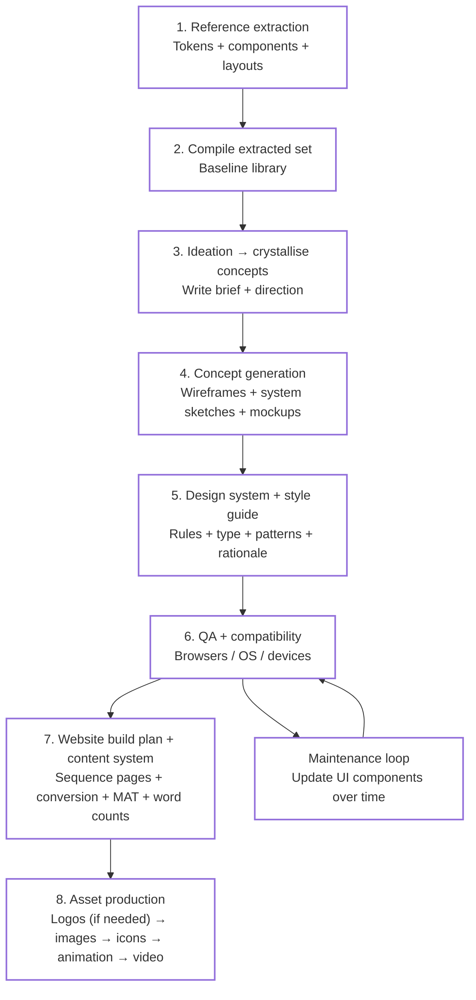
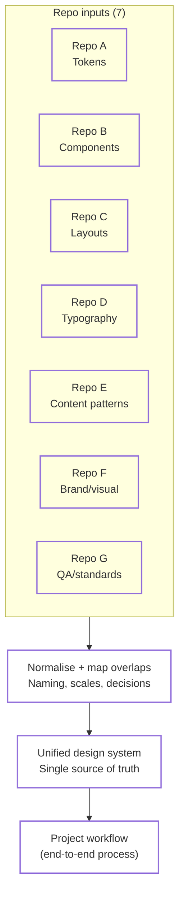

# Design system, logos and branding

Created time: 11 April 2026 04:56
Notes: - Design system extraction: tokens and layouts compiled.
- Ideation phase completed; concepts need crystallization.
- Asset production follows logo finalization for websites.
Priority: High
Status: In Progress

# Links to Reels

https://www.tiktok.com/@adrien.ninet/video/7567767826300275990?is_from_webapp=1&sender_device=pc&web_id=7599002000335996439

https://www.tiktok.com/@adrien.ninet/photo/7569185812751863062?is_from_webapp=1&sender_device=pc&web_id=7599002000335996439

https://www.tiktok.com/@adrien.ninet/photo/7581365219528559894?is_from_webapp=1&sender_device=pc&web_id=7599002000335996439

https://www.tiktok.com/@adrien.ninet/video/7600531491361262870?is_from_webapp=1&sender_device=pc&web_id=7599002000335996439

https://www.tiktok.com/@adrien.ninet/video/7605339472200305942?is_from_webapp=1&sender_device=pc&web_id=7599002000335996439

https://www.tiktok.com/@adrien.ninet/video/7613145215095950614?is_from_webapp=1&sender_device=pc&web_id=7599002000335996439

https://www.tiktok.com/@adrien.ninet/video/7615303750411980054?is_from_webapp=1&sender_device=pc&web_id=7599002000335996439

https://www.tiktok.com/@adrien.ninet/video/7615524404386073878?is_from_webapp=1&sender_device=pc&web_id=7599002000335996439

https://www.tiktok.com/@adrien.ninet/photo/7617803923662933270?is_from_webapp=1&sender_device=pc&web_id=7599002000335996439

https://www.tiktok.com/@adrien.ninet/video/7620865937473817878?is_from_webapp=1&sender_device=pc&web_id=7599002000335996439

https://www.tiktok.com/@adrien.ninet/video/7622028638266903830?is_from_webapp=1&sender_device=pc&web_id=7599002000335996439

https://www.tiktok.com/@adrien.ninet/video/7623486895430831382?is_from_webapp=1&sender_device=pc&web_id=7599002000335996439

https://www.tiktok.com/@adrien.ninet/video/7626499323106299158?is_from_webapp=1&sender_device=pc&web_id=7599002000335996439

[https://www.tiktok.com/@nikredl/video/7616740505522654486?is_from_webapp=1&sender_device=pc&web_id=7599002000335996439](https://www.tiktok.com/@nikredl/video/7616740505522654486?is_from_webapp=1&sender_device=pc&web_id=7599002000335996439)

---

### Table of design systems and ideas

| Creator | Description (from the saved caption text) | Link (clean display, original URL intact) |
| --- | --- | --- |
| Adrien Ninet | Google’s new AI tool “Pomelli” that turns a website into a full brand kit and on-brand social posts quickly. | [tiktok.com/@adrien.ninet/video/7567767826300275990](http://tiktok.com/@adrien.ninet/video/7567767826300275990) |
| Adrien Ninet | A curated list of AI tools used daily to run a business (organised by category: design, productivity, etc.). | [tiktok.com/@adrien.ninet/photo/7569185812751863062](http://tiktok.com/@adrien.ninet/photo/7569185812751863062) |
| Adrien Ninet | “Nano Banana Pro” prompt examples for designers (logo styles, full brand kits, packaging, redesign variations, etc.). | [tiktok.com/@adrien.ninet/photo/7581365219528559894](http://tiktok.com/@adrien.ninet/photo/7581365219528559894) |
| Adrien Ninet | Workflow: generate a CSV of competitors, upload to “Mino”, and have an agent scan sites in parallel to extract pricing/features fast. | [tiktok.com/@adrien.ninet/video/7600531491361262870](http://tiktok.com/@adrien.ninet/video/7600531491361262870) |
| Adrien Ninet | AI motion/animation workflow using “Higgsfield Vibe Motion”: upload a reference image, describe motion, then refine colours/fonts/styles. | [tiktok.com/@adrien.ninet/video/7605339472200305942](http://tiktok.com/@adrien.ninet/video/7605339472200305942) |
| Adrien Ninet | Building an entire marketing campaign in ~10 minutes using AI (mentions “Lovart”). | [tiktok.com/@adrien.ninet/video/7613145215095950614](http://tiktok.com/@adrien.ninet/video/7613145215095950614) |
| Adrien Ninet | Automating a design studio with AI agents (briefings, workspace setup, welcome email, team notifications) — build agents inside Notion. | [tiktok.com/@adrien.ninet/video/7615303750411980054](http://tiktok.com/@adrien.ninet/video/7615303750411980054) |
| Adrien Ninet | Launch an online product fast (ecommerce + AI automation / no-code angle). | [tiktok.com/@adrien.ninet/video/7615524404386073878](http://tiktok.com/@adrien.ninet/video/7615524404386073878) |
| Adrien Ninet | “Top 6 Claude skills for designers” (design tools / UI / web design). | [tiktok.com/@adrien.ninet/photo/7617803923662933270](http://tiktok.com/@adrien.ninet/photo/7617803923662933270) |
| Adrien Ninet | Adding a grid effect to a portfolio quickly (mentions Framer; offers a free component link via comment keyword “EFFECT”). | [tiktok.com/@adrien.ninet/video/7620865937473817878](http://tiktok.com/@adrien.ninet/video/7620865937473817878) |
| Adrien Ninet | AI-powered moodboards to reduce/avoid endless client revisions (prompting discussion: “how do you use AI?”). | [tiktok.com/@adrien.ninet/video/7622028638266903830](http://tiktok.com/@adrien.ninet/video/7622028638266903830) |
| Adrien Ninet | “Google Stitch” concept: extract a brand/design system into a portable `DESIGN.md` file so AI can understand the brand. | [tiktok.com/@adrien.ninet/video/7623486895430831382](http://tiktok.com/@adrien.ninet/video/7623486895430831382) |
| Adrien Ninet | A GitHub repo containing 58 design systems (Stripe/Apple/Linear etc.) — positioned as enabling “premium websites with Claude Code”. | [tiktok.com/@adrien.ninet/video/7626499323106299158](http://tiktok.com/@adrien.ninet/video/7626499323106299158) |
| nikredl | (No caption saved here) TikTok link captured without additional description text. | [tiktok.com/@nikredl/video/7616740505522654486](http://tiktok.com/@nikredl/video/7616740505522654486) |

Notion AI is transcribing this meeting.

website design system extraction taking the tokens pixel by pixel so you might have an idea where you want to take apple.com and extract all of that because from the ...science is the knowledge you can't... Colours, patterns. you also can get Structures tables cards. and the balance, et cetera. One set will be compiled. You're going to need to put together your brief and your concepts because we've done the first part which is your ideation.

the The concepts have to be crystallized. before we move on to the stage where you're going to do logos and branding generation if required. Now it's going to have to take a step where you've got ideation, concept generation, And we can follow that. away from the new boat into closer to the finished product In idea form. Like more cups. wireframes, systems, etc. Once we've got that, we want to get to the Most people, not designers or relatives of mine, to the rules.

Design Systems, God Guides, the psychology, the science behind it. to ensure things like fonts, etc. are structured in such a way that we design and patterns and matching fonts The components inspiration say that we've used the website extraction of Iran. We still need to think about components and styles and All they can be compared. you websites across browsers operation operating system devices.

Did I render correctly on the devices? Well, you have to update the UI components when they come out of the day. with a break on different websites this is going to be a thing to talk about In the context. You even could have a rebuild of your current website or you need to generate a content and it's wanting to write the content but there's a sequential order of content for us at our landing page for conversion optimization You've got to think about how many words in those sections on the page are you using the into four, i.e. number four and MAT, M-A-T. methodology in order to get over clear and concise So once you've built your website, you've got your logos.

You will then have images for your website. How do we generate these images? The icons. any form of animations. Maybe you want to use a video, etc. of inspiration.

## Process order from transcript

1. **Reference extraction** — tokens + components + layouts
2. **Compile extracted set** — baseline library
3. **Ideation → crystallise concepts → write brief**
4. **Concept generation** — wireframes + system sketches + mockups
5. **Design system + style guide** — rules + type + patterns + rationale/psychology
6. **QA + compatibility** — browsers / OS / devices
7. **Website build plan + content system** — sequence pages + conversion + MAT + word counts
8. **Asset production** — logos (if needed) → images → icons → animation → video

---

## Mermaid workflow (end-to-end)

---

## Mermaid overlay: unify 7 repos into one system

