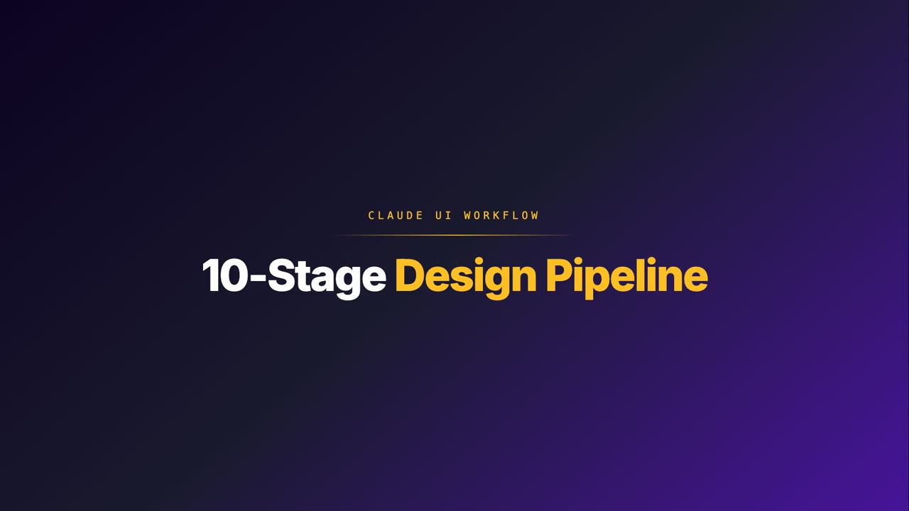

<picture>
  <source media="(prefers-color-scheme: dark)" srcset="assets/logo-dark.svg">
  <source media="(prefers-color-scheme: light)" srcset="assets/logo-light.svg">
  
</picture>

<br/>


**A 10-stage design pipeline that turns a brand brief into production-ready UI.**
**165+ rules across 15 design-system databases ensure the output never looks like AI made it.**

<!-- VIDEO -->
<a href="https://pipeline-proof.netlify.app/explainers.html"></a>

> **Walkthrough video:** 65-second tour of the 10-stage pipeline. ▶ [Watch on pipeline-proof](https://pipeline-proof.netlify.app/explainers.html). Full release: [v0.1-demo](https://github.com/sellersessions/claude-ui-workflow/releases/tag/v0.1-demo).

```mermaid
%%{init: {'theme': 'dark', 'themeVariables': {'clusterBkg': 'transparent', 'clusterBorder': '#8b949e', 'nodeTextColor': '#e8e8e8', 'primaryTextColor': '#e8e8e8'}}}%%
flowchart LR
    subgraph FOUND["Foundation (1-5)"]
        direction LR
        S1["1<br/>Intake"] --> S2["2<br/>URL"]
        S2 --> S3["3<br/>Screenshot"]
        S3 --> S4["4<br/>Validate"]
        S4 --> S5["5<br/>Lock"]
    end
    subgraph CREATIVE["Creative (6-7)"]
        direction LR
        S6["6<br/>Brief"] --> S7["7<br/>Stitch"]
    end
    subgraph CYCLE["Audit + Cycle (8-10)"]
        direction LR
        S8["8<br/>Refine"] --> S9["9<br/>Retro"]
        S9 --> S10["10<br/>Reset"]
    end
    FOUND --> CREATIVE --> CYCLE
    CYCLE -.->|next cycle| FOUND

    style S1 fill:none,stroke:#14B8A6,stroke-width:1px,color:#fff
    style S2 fill:none,stroke:#14B8A6,stroke-width:1px,color:#fff
    style S3 fill:none,stroke:#14B8A6,stroke-width:1px,color:#fff
    style S4 fill:none,stroke:#14B8A6,stroke-width:1px,color:#fff
    style S5 fill:none,stroke:#14B8A6,stroke-width:1px,color:#fff
    style S6 fill:none,stroke:#8B5CF6,stroke-width:1px,color:#fff
    style S7 fill:none,stroke:#8B5CF6,stroke-width:1px,color:#fff
    style S8 fill:none,stroke:#EC4899,stroke-width:1px,color:#fff
    style S9 fill:none,stroke:#F59E0B,stroke-width:1px,color:#fff
    style S10 fill:none,stroke:#F59E0B,stroke-width:1px,color:#fff
```

<!-- /VIDEO -->



> **Foundation 1-5** (teal): extracts brand DNA and locks the foundation.
> **Creative 6-7** (purple): writes the design brief and Stitch paints it.
> **Audit + Cycle 8-10** (pink + amber): refines, learns, and resets clean for the next brand.

---

## Why this exists

You're an Amazon seller. You've got a product, a story, and a brand voice. What you don't have is six months of design school, a Figma certification, or a UX team on retainer. You want a landing page that looks like it cost £20K - without the £20K.

This is what happens when you pull this repo. Ten stages. You see the beautiful output. We do the alchemy underneath.

If you tried to run these ten steps yourself, you'd need to be a brand strategist, a colour theorist, a typographer, a copywriter, a prompt engineer, a UX auditor, and a project manager. You'd burn three weeks. The output would still look AI-generated. We hide all of it. You see a beautiful page. That's the trick - lead in, gold out, and you never have to know what went on in the crucible.

---

## What you can build

Sourced from real Amazon-seller use cases - full reasoning + footnoted references in [`Google Stitch-10 ideas for amazon sellers.md`](./Google%20Stitch-10%20ideas%20for%20amazon%20sellers.md).

| # | Use case | Output |
|---|---|---|
| 1 | Brand storefront landing pages | HTML / CSS for Netlify or Webflow, drives external traffic to Amazon |
| 2 | Email newsletter templates | 600px-wide single-column HTML, retention + launch campaigns |
| 3 | Social media graphic templates | Reusable Instagram / Facebook story templates with brand tokens |
| 4 | Lead magnet / funnel pages | Discount-code capture, waitlists, early-access launches |
| 5 | Instagram / Facebook ad mockups | Rapid creative testing before paying for production design |
| 6 | Product comparison infographics | Side-by-side comparisons for A+ Content or social posts |
| 7 | Launch campaign countdown pages | Pre-order, Kickstarter-style hype pages with email capture |
| 8 | Video thumbnail templates | Consistent YouTube / TikTok thumbnails for product demos |
| 9 | Brand style guide documentation | One reference doc your VAs and agencies actually follow |
| 10 | Customer feedback / survey forms | Branded review collection with progress bars and incentives |

The same workflow also produces SaaS dashboards, mobile-app prototypes, multi-page user flows, dashboard admin interfaces, and design-system variations - anything where the inputs are a brand and a brief and the output is shippable UI.

---

## Before / After - live samples

Three real brands run through the full 10-stage workflow. All passed Stage 8 hard-fail audit (every locked string from the brand's source-truth verbatim in the rendered DOM, every anti-drift string absent). Click any link to compare.

| Brand | Original site | Workflow output | REFINE score | Notes |
|---|---|---|---|---|
| Re Tech UK | [retechuk.com](https://retechuk.com) | [retechuk-cycle3.netlify.app](https://retechuk-cycle3.netlify.app) | 27/30 | Editorial fashion. 0 patches needed - model gate routed to Stitch 3.1 Pro for copy fidelity, shipped clean on first audit. |
| Databrill Core | [core.databrill.com](https://core.databrill.com) | [databrill-core-cycle3.netlify.app](https://databrill-core-cycle3.netlify.app) | 27/30 | Dark-palette SaaS. 1 patch - Stage 8 hard-fail caught 4 missing `<h3>` titles in problem-grid that visual review missed. |
| Push-Pull Agency | [pushpullagency.com](https://pushpullagency.com) | [pushpullagency-cycle4.netlify.app](https://pushpullagency-cycle4.netlify.app) | 28/30 | Full-service Amazon agency. 1 refine pass - restored Stitch design language (massive 2-line hero, left icon rail, cobalt parallelogram clip-shapes, accent cards) while keeping all 45 locked strings verbatim. |

All three deliverables started from a real URL → extract-flow ingestion → source-truth.json + locks.json → Stitch visual brief → Claude-written HTML merged with locked copy → 6-dimension REFINE audit → cycle reset gate.

**A few things to know about these comparisons:**

- **Not a 1:1 image clone.** This is a design system being applied to your page - colour, typography, layout, component behaviour, motion language. The placeholder visuals in our samples come from Stitch's renderer; on your live site you'd swap in your own product photography, brand assets, and team shots. The system carries the *design language*, not the source brand's images.
- **First-pass output.** What you see is the output of a single pass through the workflow. You can iterate as many times as you want, but the entire point of the system is to land an excellent first pass - design and aesthetic are subjective, and we don't have time for endless revisions. The goal is a strong, on-brand starting point that holds up to scrutiny on day one.

---

## How it works - the 10 stages

The full canonical reference (with autonomy classes and per-stage pre-checks) is in [`PRE-CHECK-CHECKLISTS.md`](./PRE-CHECK-CHECKLISTS.md). The architecture is in [`DESIGN-PIPELINE-VISUAL.md`](./DESIGN-PIPELINE-VISUAL.md). What follows is the plain-English version.

### Stage 1 - INTAKE

You answer a handful of questions. Not fifty - just enough for the system to know who the page is for, what the offer is, what the vibe should feel like. We're not interviewing you for a textbook. We're listening for the signal that lets the next nine stages run on rails.

### Stage 2 - URL ingestion (extract-brand)

Got an existing site, or a competitor you admire? Drop the URL. We pull the brand DNA out - colours, fonts, hierarchy, voice - without you needing to know what a hex code is or what "type scale" means. The whole brand identity becomes structured data we can act on. You don't open Photoshop. You don't pick fonts. You drop a link.

### Stage 3 - Screenshot assist (low-confidence rescue)

Sometimes URL extraction misses things - cream-on-cream hero bands, dark themes hidden behind cookie banners, subtle gradients. When confidence is low, we capture the page visually and read it the way a designer's eye would. You don't have to know it happened. You just notice the output is right.

### Stage 4 - Tokens validate

Every colour, font, and spacing rule gets locked into a single source of truth. This is the bit design agencies charge five figures for and call a "design system." You get it free, and you get it in 30 seconds. From here on, nothing in the build can drift outside those rails.

### Stage 5 - Lock primitive

You eyeball the foundation and sign it off. Once locked, no AI tool is allowed to overwrite it. This is the rule that stops the model going off-script halfway through and inventing a new colour palette out of thin air. Your brand stays your brand for the rest of the workflow.

### Stage 6 - Design brief assembly

Here's the part no Amazon seller has ever had to do - and now never will. The system writes the design brief itself, in the exact language the design model needs, pulling everything we locked from Stages 1 to 5. You don't write prompts. You don't learn prompt engineering. You collect the output.

### Stage 7 - Stitch generation

Google's Stitch model paints the page. We've already learned which model variant to use for which job - 3.1 Pro for copy-faithful work, never 3 Flash for multi-section pages, Refresh mode for canonical brands. Those rules are baked in (full set in [`STITCH-MODEL-RULES.md`](./STITCH-MODEL-RULES.md)). You don't pick. You don't gamble. You don't lose a Saturday afternoon to "why does it look broken now."

### Stage 8 - REFINE pass

Now the audit. Every word in the rendered page gets cross-checked against your truth-source copy. Every layout block gets eyeballed against the design brief. Drift gets caught, hallucinations get killed, and the page that lands is the page you actually approved. This is the step a junior designer would skip and a senior designer would charge a day's billing for.

### Stage 9 - Cycle retro

Every problem we hit gets logged, classified, and either fixed before the next round or codified as a permanent rule. The system literally gets sharper every time you use it. The version of this workflow you run next month is better than the one you run today - without you having to lift a finger.

### Stage 10 - Cycle reset gate

Clean handoff. Nothing from the last brand leaks into the next one. Your supplements brand doesn't accidentally inherit your fashion brand's palette. Boring on the surface, ruthless underneath - and the reason you can run this on five products in a row without the work degrading.

---

## What you need to run this

Honest dependency surface - what comes in this repo, what a stranger brings.

| Dependency | In the repo? | What you bring |
|---|---|---|
| `scripts/audit-copy.py`, `emit-tokens.py`, `ingest-url.py`, `ingest-doc.py`, `refine-from-screenshot.py`, `ref-image-check.py` | ✅ in `scripts/` | Python 3.10+ and `pip install -r requirements.txt` |
| `extract-flow` (4-tier extraction cascade - HTTP → headless → CDP → SeleniumBase) | ❌ sibling repo | Clone [`sellersessions/extract-flow`](https://github.com/sellersessions/extract-flow) next to this one. Without it, Stage 2 falls back to plain `WebFetch`. |
| Claude Code (CLI) and the `/intake`, `/lock`, `/refine` skills | ❌ external | Install Claude Code. The skill manifests templated under `.claude/skills/` ship with this repo. |
| Stitch (Google Labs) | ❌ external | Free Google account. Stage 7 is a manual paste-and-iterate in the Stitch web UI. |
| Netlify (deploy target) | ❌ external | Free tier works. One of many possible static targets - Vercel, Cloudflare Pages, GitHub Pages, plain S3 all fine. |
| Computer-use MCP (Stage 8 visual validation) | ❌ external | Optional. Falls back to headless Chrome `--screenshot` if absent. |
| Memory layer (ChromaDB / similar) | ❌ external | Optional. Used by the operator's session-close hooks. The workflow itself doesn't require it. |

**Plain English:** if you have Claude Code and Python, stages 1, 2, 4, 5, 6, 8, 9, 10 run today. Stage 3 (screenshot rescue) needs computer-use MCP or you do it manually. Stage 7 (Stitch) is a manual paste-and-iterate. Cloning `extract-flow` alongside this gives Stage 2 the full cascade; without it, Stage 2 falls back to plain `WebFetch`.

---

## How fast is it?

The speed comes from rules getting written down. Each cycle codifies what was tribal into `PRE-CHECK-CHECKLISTS.md`, `STITCH-MODEL-RULES.md`, and the audit script - so the next cycle takes less attention.

- **Cycle 1 (Re Tech UK).** 29 findings logged. Every stage operator-supervised. The pipeline shape was right; the codification work was the gap.
- **Cycle 2 (Databrill Core).** 8 new findings. The v2 architecture shipped: `PRE-CHECK-CHECKLISTS.md` + `STITCH-MODEL-RULES.md` + the cycle-2 fix wave. `audit-copy.py` debuted as a programmatic Stage 8 gate. The visual-brief merge primitive (Stitch design DNA × locked source-truth copy) proved out.
- **Cycle 3 (Databrill Core, Stage 8 hard-fail).** 3 findings. The hard-fail copy audit caught 4/88 silently-dropped headings that visual review missed. Stage 8 promoted from check to blocking gate.
- **Cycle 4 (Push-Pull Agency).** Stages 1-6 ran in ~8 minutes autonomously. The first real operator interaction was Stage 7 (Stitch). Stage 8 audit was a one-shot pass - 45/45 locked strings present, 0 anti-drift hits. Total active operator time: ~50 minutes, mostly design taste calls in Stitch.

Each cycle's rules trust themselves a little more, so the operator's review collapses toward taste calls only.

---

## Quickstart - folder map

There is no `npm run pipeline`. The repo is a workflow surface, not a single executable. Pull it, then read in this order:

| Path | What it is | When to look |
|---|---|---|
| [`PRD.md`](PRD.md) | North star - the goal in plain English | First |
| [`RUNBOOK.md`](RUNBOOK.md) | What works today vs what's queued | Second |
| [`PRE-CHECK-CHECKLISTS.md`](PRE-CHECK-CHECKLISTS.md) | The 10-stage canonical with per-stage pre-checks | Reference for any stage |
| [`STITCH-MODEL-RULES.md`](STITCH-MODEL-RULES.md) | Stitch model selection rules (Stage 7) | Before you generate |
| [`DESIGN-PIPELINE-VISUAL.md`](DESIGN-PIPELINE-VISUAL.md) | Architecture deep-dive - Mermaid diagrams + 15 CSV catalogue | When extending the system |
| [`MASTER-LOG.md`](MASTER-LOG.md) | Session-by-session timeline + active kickoff | When picking up work |
| [`OUTSTANDING-WORK.md`](OUTSTANDING-WORK.md) | Rolling work list with milestones | Before starting a branch |
| `brands/` | One folder per brand (`profile.md`, `tokens.json`, `locks.json`) | Set up your brand |
| `design-db/` | The 15 CSV databases - 165+ rules driving every decision | Add or audit a rule |
| `design-system-sections/` | ADRs and longer design notes (8 sections today) | Architectural change |
| `dogfood/` | Per-cycle dogfood runs with friction logs and captures | Cycle history / learning |
| `scripts/` | Brand ingestion (`ingest-url.py`, `ingest-doc.py`, `refine-from-screenshot.py`) | Run a stage manually |
| `examples/` | Worked examples for reference | Copy-paste a starting point |
| `_archive/` | Retired tools and reference IP | Historical only |

### Brand ingestion (URL mode)

```bash
npm install                                                          # one-off (Playwright + Chromium)
python3 -m venv .venv && .venv/bin/pip install -r requirements.txt   # one-off (Pillow for screenshot assist)

python3 scripts/ingest-url.py https://example.com --slug example-derived
```

Writes `brands/example-derived/{tokens.json, profile.md, ingestion-confidence.md}`. The confidence file flags low/medium-confidence palette roles.

### Brand ingestion (screenshot rescue)

When extraction confidence is weak, refine with a Shottr full-page screenshot:

```bash
.venv/bin/python3 scripts/refine-from-screenshot.py \
    --slug example-derived \
    --screenshot ~/Screenshots/example-2026-04-25.png
```

Samples nav, hero, and body bands; proposes overrides for `secondary`, `cta`, `text_secondary`; rewrites `tokens.json` and appends a `## Screenshot Overrides` section to the confidence doc. Use `--no-prompt` for dry-run, `--show-palettes` to inspect per-region quantised palettes.

### Brand ingestion (style-guide doc mode)

```bash
python3 scripts/ingest-doc.py path/to/brand-guide.md --slug example-derived
```

Two-pass parser: strict pass for canonical-shape docs (`## Identity`, `## Theme`, `## Colours`, `## Typography`), fuzzy fallback for free-form guides (line-context hex + role keywords). Markdown / plain text only - convert PDF / docx / Notion exports first.

---

## Brand profiles

Brand profiles drive every stage. One folder per brand, one canonical `profile.md`, optional `tokens.json` and `locks.json`. Two worked examples ship with the repo:

| | Seller Sessions | Databrill Core |
|---|---|---|
| **Theme** | Dark, glassmorphic | Dark, glass + mesh-gradient |
| **Primary** | `#461499` purple | `#0c0a14` background |
| **Accent** | `#FBBF24` gold | `#e07a3a` orange |
| **Secondary** | - | `#7c6bbd` purple |
| **Headings** | Plus Jakarta Sans | Inter |
| **Body** | Inter / Poppins | DM Sans |
| **Display** | - | Space Grotesk |
| **Animation** | Subtle sophisticated, 200-500ms | Clean restrained, 150-300ms |
| **Deploy target** | WordPress (REST API) | Netlify static build |
| **LCP target** | < 2.5s | < 2.0s |

```
brands/
├─ _template/profile.md          ← copy this when adding a new brand
├─ sellersessions/
│  ├─ profile.md
│  ├─ tokens.json
│  └─ locks.json
├─ databrill-core/
│  ├─ profile.md
│  └─ tokens.json
└─ <your-brand>/                 ← yours goes here
```

New brands copy `brands/_template/profile.md` - every section including performance budgets and animation preferences. Status per brand lives in [`brands/INVENTORY.md`](brands/INVENTORY.md).

---

## What's actually inside

Without itemising every rule (the full enumeration lives in [`DESIGN-PIPELINE-VISUAL.md`](DESIGN-PIPELINE-VISUAL.md)):

- **15 CSV design databases, 165+ rules** - colours, typography, page structure, anti-patterns, animation timing, accessibility, cognitive science, performance budgets
- **4 quality gates** - design-token extraction, web-design guidelines, React performance, composition patterns
- **6-dimension REFINE audit** - refinements, animation, polish, performance, anti-AI, HCI laws
- **10-stage pipeline** orchestrating Claude Code skills, MCPs (Stitch, 21st.dev Magic, NanoBanana2, Video Transcriber, Sequential Thinking), Playwright auth-persisted Chromium, and the 15 CSV rule databases - full per-stage tool map in [`DESIGN-PIPELINE-VISUAL.md`](./DESIGN-PIPELINE-VISUAL.md)

---

## What if...

### ...you have a portfolio of brands?

Stages 1 to 5 are mostly Class A (Claude end-to-end). Drop one URL per brand, walk away, come back to a folder of `tokens.json` + `locks.json` per brand. Stage 6 onward runs per-brand on demand. Adding a tenth brand has roughly the same cost as adding the second.

### ...your VA does the brand-onboarding?

The `/intake` skill walks them question-by-question, no Figma, no design background, no prompt-engineering. Lock the brand once, hand them `RUNBOOK.md`, and they ship landing pages that don't drift from your house style.

### ...you don't have `extract-flow` cloned?

Stage 2 falls back to plain `WebFetch`. Lower-confidence palette extraction, but the rest of the pipeline still runs. Stage 3 (Screenshot assist) is the rescue path when Stage 2 confidence is weak.

### ...Stitch is offline or rate-limited?

Stages 1 to 6 run regardless: they generate the brief. Stage 7 is the only Stitch dependency. You can hand the Stage 6 brief to any visual model (Claude artifacts, v0, Lovable, Cursor) and Stage 8 still audits the output the same way.

### ...the cycle gets sharper over time?

Stage 9 codifies findings into `PRE-CHECK-CHECKLISTS.md`. Cycle 1 logged 29 findings. Cycle 4 ran in ~50 minutes of active operator time, mostly Stitch taste calls. Each cycle's review collapses toward taste-only.

---

## Companion repos

This repo ships with two siblings: same author, same operating principles, different production surface.

| Repo | What it does |
|---|---|
| [`claude-remotion-flow`](https://github.com/sellersessions/claude-remotion-flow) | Programmatic video production. Treatment-driven, beat-synced, single-stem VO. |
| [`claude-video-editing-flow`](https://github.com/sellersessions/claude-video-editing-flow) | Selection-led short-form cuts. Drop a video, tick candidates in markdown, render. |

All three are designed to run alongside [`ClaudeFlow-Agent`](https://github.com/sellersessions/ClaudeFlow-Agent), the personal AI operating system that ties them together.

---

## Going deeper

| You want to… | Read |
|---|---|
| Understand the architecture | [`DESIGN-PIPELINE-VISUAL.md`](DESIGN-PIPELINE-VISUAL.md) |
| Run a specific stage | [`PRE-CHECK-CHECKLISTS.md`](PRE-CHECK-CHECKLISTS.md) |
| Choose the right Stitch model | [`STITCH-MODEL-RULES.md`](STITCH-MODEL-RULES.md) |
| See what works today vs what's queued | [`RUNBOOK.md`](RUNBOOK.md) |
| Read the goal | [`PRD.md`](PRD.md) |
| Pick up where the last session ended | [`MASTER-LOG.md`](MASTER-LOG.md) |
| See findings + decisions per dogfood cycle | `dogfood/<YYYY-MM-DD>-<slug>/friction-log.md` |
| Browse worked examples | `examples/` |

---

## Status

**Cycles 1-3 closed; cycle-4 in flight.** ~40 friction findings dispositioned across the four cycles to date.

- Cycle-1 (Re Tech UK, 25 Apr): 29 findings → drove the v2 architecture rewrite.
- Cycle-2 (Databrill Core, 26 Apr): 8 new findings → fix wave shipped; visual-brief merge primitive proven.
- Cycle-3 (Databrill Core re-run, 27 Apr): 3 findings → hard-fail copy audit promoted to blocking Stage 8 gate.
- Cycle-4 (Push-Pull Agency, 27 Apr): Stage 8 PASS (45/45 locked strings, 15/15 anti-drift). Stage 9 retro + Stage 10 lock in flight.

**Cycle-5 queue (deferred infra):**

1. `source-truth.json` schema v2 - explicit `copy:` vs `meta:` split (cycle-3 #39).
2. `/lock` skill always emits `anti_drift_strings` field (cycle-3 #40).
3. Stage 7 pre-flight gate auto-routes by `locks.json::must_preserve_copy`.
4. Cycle-2 fix-wave residue (#30 / #31 / #32 / #33).
5. Retrofit Re Tech UK + Databrill `locks.json` to schema v2.

Latest deliverable: [`dogfood/2026-04-27-pushpullagency/full-page-merged.html`](dogfood/2026-04-27-pushpullagency/full-page-merged.html) - Push-Pull Agency homepage, audit-clean. New primitive proven this cycle: Stitch Redesign output is a **visual brief**, not the deliverable. Claude reads the image, pulls truth copy from source, writes the HTML locally.

---

*15 CSVs · 165+ rules · 10-stage pipeline · 5 MCPs · 4 quality gates.*
*Last updated: 27 Apr 2026 - cycles 1-3 closed (~40 findings dispositioned), cycle-4 (Push-Pull) Stage 8 PASS, Stage 9-10 in progress.*
