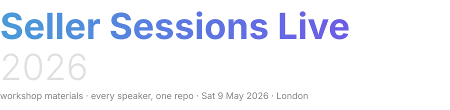
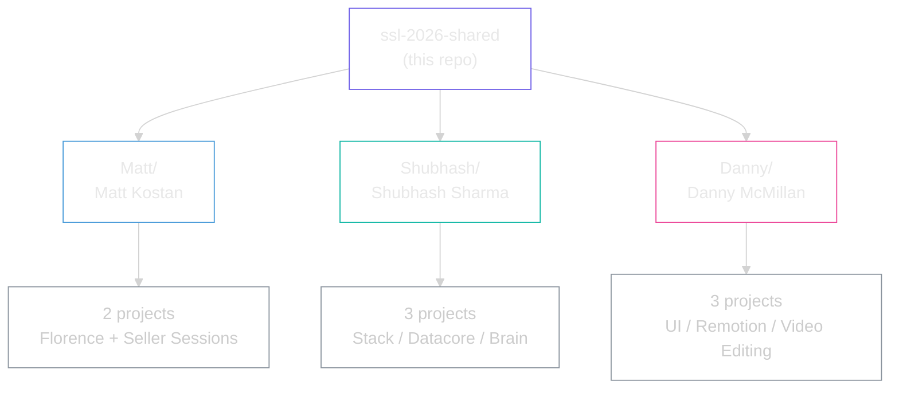

<picture>
  <source media="(prefers-color-scheme: dark)" srcset="assets/logo-dark.svg">
  <source media="(prefers-color-scheme: light)" srcset="assets/logo-light.svg">
  
</picture>

 

**Workshop materials from every SSL 2026 speaker, in one place.**
**Grab what you need after the event. No git knowledge required.**

> [!NOTE]
> **TL;DR.** One folder per speaker. Open the folder, follow the `README.md` inside it. Each speaker brings their own setup steps.

---

## How it's organised

---

## The speakers

| Folder | Speaker | Session |
|---|---|---|
| [`Matt/`](./Matt) | Matt Kostan | Florence : AI Chief Data Analyst for Amazon |
| [`Shubhash/`](./Shubhash) | Shubhash Sharma | Architecting the Amazon Operator's Stack |
| [`Danny/`](./Danny) | Danny McMillan | Human in the Loop, Creative Suite |

More speakers will be added here as their materials land.

---

## How to use this

You don't need to be technical, and you don't need git.

1. Click the green **`<> Code`** button at the top of this page.
2. Choose **Download ZIP**.
3. Unzip on your laptop.
4. Open the speaker's folder you care about, and follow the `README.md` inside it. Each speaker has their own setup steps.

If you only want one speaker's material, you can also open their folder here on GitHub and download files individually.

---

## Questions

If something in a speaker's folder doesn't work or is missing, ask in the SSL 2026 attendee channel and we'll route it to the right speaker.
