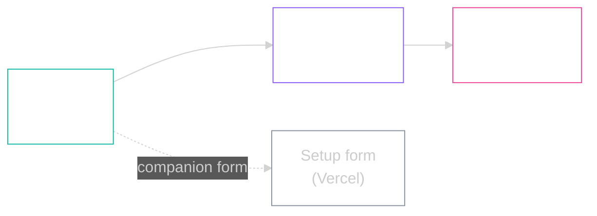

<picture>
  <source media="(prefers-color-scheme: dark)" srcset="assets/logo-dark.svg">
  <source media="(prefers-color-scheme: light)" srcset="assets/logo-light.svg">
  
</picture>

<br/>


**Architecting the Amazon Operator's Stack.**
**Three deliverables, snapshotted from stage day.**

> [!NOTE]
> **TL;DR.** Operator-grade stack: a one-shot setup, a 5-schema Supabase data lake, and an Obsidian brain template. All three public, all three MIT-licensed.

---

## The stack at a glance



---

## The three deliverables

For the live versions (with future updates), use the canonical repos:

| Folder | Canonical repo | Purpose |
|---|---|---|
| `amazon-operator-stack-main/` | [ShubhashSharma/amazon-operator-stack](https://github.com/ShubhashSharma/amazon-operator-stack) | Take-home stack setup. Companion form: [amazon-operator-stack-setup.vercel.app](https://amazon-operator-stack-setup.vercel.app) |
| `operator-datacore-main/` | [ShubhashSharma/operator-datacore](https://github.com/ShubhashSharma/operator-datacore) | 5-schema Supabase data lake (raw / brain / ops / analytics / meta) |
| `brain-template-main/` | [ShubhashSharma/brain-template](https://github.com/ShubhashSharma/brain-template) | Obsidian Operator's Brain template |

---

## Quick install: Brain template

```bash
curl -fsSL https://raw.githubusercontent.com/ShubhashSharma/brain-template/main/setup.sh | bash
```

For the other two, follow the canonical repo READMEs linked above.

---

## Questions

If something's broken or missing, ping the SSL 2026 attendee channel.
